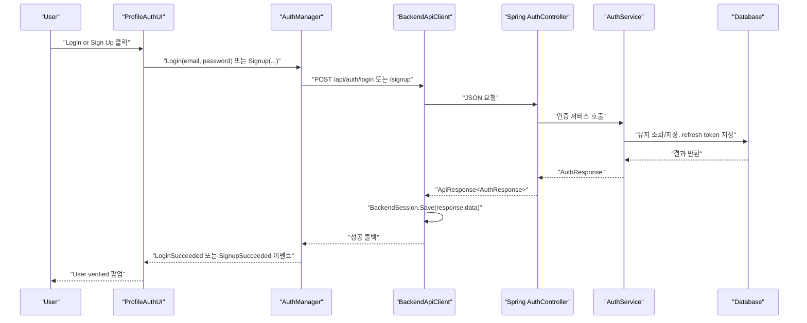
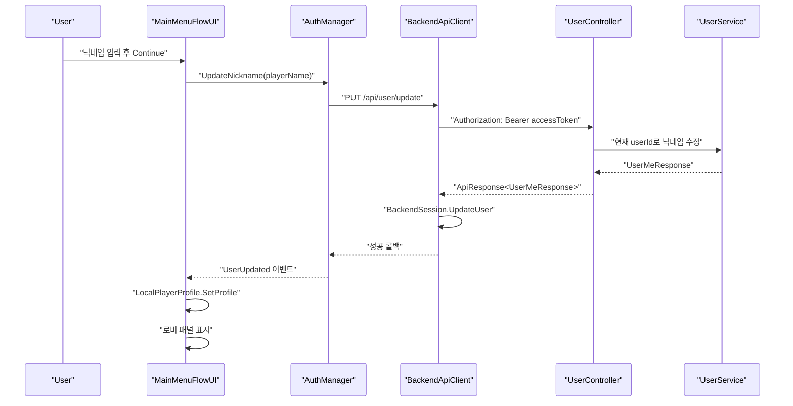
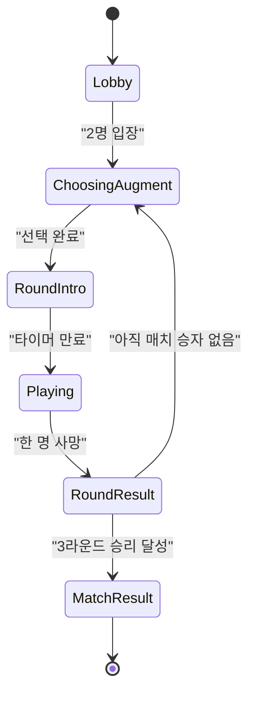
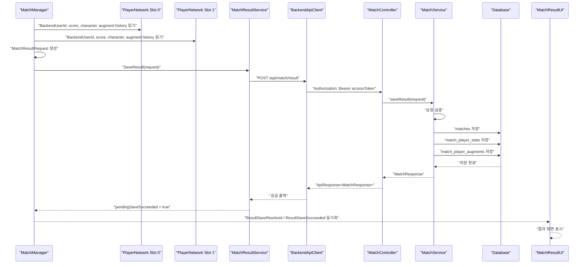
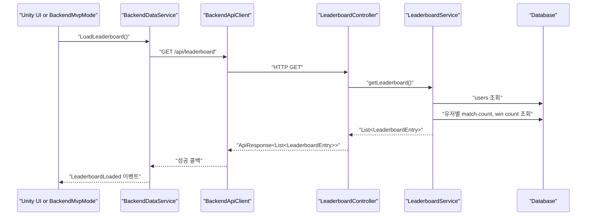
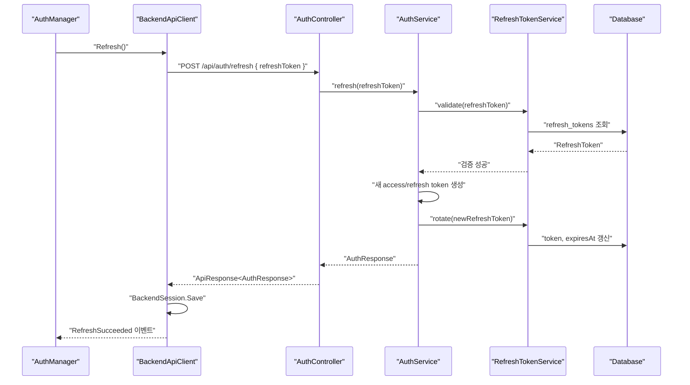

# Unity와 백엔드 연동 흐름 문서

이 문서는 Unity 클라이언트와 Spring Boot 백엔드가 실제로 어떻게 연결되는지 설명한다. Unity 구현 문서와 백엔드 구현 문서를 따로 읽어도 되지만, 이 문서는 두 시스템이 맞물리는 순서에 집중한다.

## 1. 전체 흐름 요약

게임에서 백엔드가 직접 관여하는 큰 흐름은 다음이다.

1. 유저가 Unity 로그인 화면에서 이메일/비밀번호를 입력한다.
2. Unity가 백엔드 `/api/auth/login` 또는 `/api/auth/signup`을 호출한다.
3. 백엔드는 access token, refresh token, userId, email, nickname을 반환한다.
4. Unity는 이 값을 `BackendSession`에 저장한다.
5. 유저가 캐릭터와 닉네임을 선택한다.
6. Unity가 `/api/user/update`로 닉네임을 서버에 저장한다.
7. Photon Fusion 방에 입장하면 `PlayerNetwork`가 백엔드 userId를 네트워크 상태로 전달한다.
8. 매치가 끝나면 `MatchManager`가 양쪽 플레이어의 backend userId와 점수, 증강 기록을 모은다.
9. Unity가 `/api/match/result`로 매치 결과를 저장한다.
10. 백엔드는 `matches`, `match_player_stats`, `match_player_augments`에 저장한다.
11. 필요하면 Unity가 `/api/leaderboard`, `/api/match/history`, `/api/augments`를 조회한다.

## 2. 관련 Unity 클래스

| 클래스 | 연동 역할 |
| --- | --- |
| `BackendApiClient` | 실제 HTTP 요청을 만든다 |
| `BackendModels` | 백엔드 요청/응답 JSON 구조를 C# 클래스로 표현한다 |
| `BackendSession` | 토큰과 유저 정보를 저장한다 |
| `AuthManager` | 로그인/회원가입/토큰 갱신/유저 정보 수정 흐름을 이벤트로 감싼다 |
| `ProfileAuthUI` | 로그인/회원가입 UI에서 `AuthManager`를 호출한다 |
| `MainMenuFlowUI` | 닉네임 수정 후 `LocalPlayerProfile`을 세팅한다 |
| `PlayerNetwork` | Photon 플레이어에 backend userId를 네트워크 변수로 동기화한다 |
| `MatchManager` | 매치 종료 시 저장 요청 데이터를 만든다 |
| `MatchResultService` | 매치 결과 저장 API를 호출한다 |
| `BackendDataService` | 리더보드와 백엔드 증강 목록을 조회한다 |

## 3. 관련 백엔드 클래스

| 클래스 | 연동 역할 |
| --- | --- |
| `AuthController` | 회원가입, 로그인, refresh endpoint 제공 |
| `AuthService` | 유저 생성, 비밀번호 검증, 토큰 발급 |
| `UserController` | 내 정보 조회, 닉네임 수정 endpoint 제공 |
| `UserService` | 유저 조회와 닉네임 중복 검증 |
| `MatchController` | 매치 저장과 히스토리 endpoint 제공 |
| `MatchService` | 매치 결과 검증과 DB 저장 |
| `LeaderboardController` | 리더보드 조회 endpoint 제공 |
| `AugmentController` | 백엔드 증강 목록 endpoint 제공 |
| `JwtAuthenticationFilter` | Authorization Bearer 토큰 인증 |

## 4. 로그인/회원가입 시퀀스



Unity에서 로그인 성공 후 저장하는 값은 다음과 같다.

```text
LastRound.AccessToken
LastRound.RefreshToken
LastRound.UserId
LastRound.Email
LastRound.Nickname
```

이 값들은 `PlayerPrefs`에 저장된다.

## 5. 닉네임과 캐릭터 선택 흐름

로그인 후 유저는 캐릭터 선택 화면으로 이동한다. 여기서 입력한 닉네임은 백엔드 유저 닉네임에도 반영된다.



`LocalPlayerProfile`에는 Photon 플레이어 스폰 시 사용할 값이 들어간다.

- `PlayerName`
- `CharacterId`
- `CharacterName`

이 값은 백엔드 DB에 직접 저장되는 값은 아니다. 닉네임은 `/api/user/update`로 DB에 저장되고, 캐릭터 선택 값은 Photon 네트워크 상태와 매치 결과 저장 요청에 사용된다.

## 6. Photon 입장 후 backend userId 전달

Photon 방에 입장하면 서버 권한 쪽 `FusionBootstrap.OnPlayerJoined()`가 플레이어 프리팹을 스폰한다. 로컬 플레이어의 `PlayerNetwork.Spawned()`가 실행되면 다음 RPC를 보낸다.

```csharp
RPC_RequestApplyProfile(
    LocalPlayerProfile.CharacterId,
    LocalPlayerProfile.PlayerName,
    LocalPlayerProfile.CharacterName
);

RPC_SetBackendIdentity(localBackendUserId);
```

여기서 `localBackendUserId`는 다음 값이다.

```csharp
BackendSession.IsLoggedIn ? BackendSession.UserId : 0
```

즉, Unity 로그인에 성공한 유저만 `BackendUserId`가 0보다 큰 값으로 네트워크에 들어간다.

이 값이 중요한 이유는 매치가 끝났을 때 `MatchManager`가 다음 값을 사용하기 때문이다.

```text
slot0.BackendUserId
slot1.BackendUserId
```

둘 중 하나라도 0이거나 두 값이 같으면 백엔드 저장을 시도하지 않는다.

## 7. 매치 진행과 저장 준비

`MatchManager`는 Photon 네트워크 상태 머신으로 라운드를 진행한다.



매치가 끝나면 `EnterMatchResultPhase()`가 호출되고, 내부에서 `ReportMatchResultToBackend()`가 실행된다.

저장 전 확인하는 조건은 다음과 같다.

- 서버 권한이어야 한다.
- 이미 저장 요청을 보낸 적이 없어야 한다.
- `MatchWinnerSlot`이 0 이상이어야 한다.
- `submitMatchResultToBackend`가 true여야 한다.
- slot 0, slot 1 플레이어가 모두 있어야 한다.
- 양쪽 `BackendUserId`가 0보다 커야 한다.
- 양쪽 `BackendUserId`가 서로 달라야 한다.
- `MatchResultService.Instance`가 있어야 한다.

이 조건을 통과하면 `BuildMatchResultRequest()`로 저장 요청을 만든다.

## 8. 매치 결과 저장 시퀀스



`MatchManager`는 저장 콜백 안에서 바로 네트워크 변수를 바꾸지 않고 `pendingSaveResolved`, `pendingSaveSucceeded`에 먼저 저장한다. 이후 `FixedUpdateNetwork()`의 `MatchResult` 상태에서 네트워크 변수인 `ResultSaveResolved`, `ResultSaveSucceeded`에 반영한다. 이렇게 한 이유는 Fusion 네트워크 상태 변경을 정해진 네트워크 업데이트 흐름 안에서 처리하기 위해서이다.

## 9. 매치 결과 요청 JSON 구조

Unity의 `MatchResultRequest` 구조는 백엔드 `MatchResultRequest`와 맞춰져 있다.

```json
{
  "player1Id": 1,
  "player2Id": 2,
  "winnerId": 1,
  "player1Score": 3,
  "player2Score": 1,
  "players": [
    {
      "userId": 1,
      "result": "WIN",
      "score": 3,
      "damageDealt": 0,
      "characterName": "Knight",
      "augments": [
        {
          "augmentId": 0,
          "augmentName": "Multi Shot",
          "selectedOrder": 1,
          "selectedRound": 1
        }
      ]
    },
    {
      "userId": 2,
      "result": "LOSE",
      "score": 1,
      "damageDealt": 0,
      "characterName": "Ranger",
      "augments": [
        {
          "augmentId": 0,
          "augmentName": "Shield Orbit",
          "selectedOrder": 1,
          "selectedRound": 1
        }
      ]
    }
  ]
}
```

현재 `damageDealt`는 Unity에서 0으로 들어간다. 나중에 실제 누적 피해량을 저장하려면 `PlayerNetwork`나 `PlayerHealth` 쪽에 누적 피해량을 추가하고 이 필드에 넣으면 된다.

## 10. 증강 ID 처리 방식

Unity와 백엔드 양쪽에 증강 개념이 있지만 현재 데이터 원천이 다르다.

Unity:

- `Assets/Data/KBW/*.asset`
- `AugmentDefinition.id`
- `displayName`
- 실제 전투 효과를 가진 ScriptableObject

백엔드:

- `augments` 테이블
- `id`
- `name`
- `description`
- `effectType`

두 ID 체계가 아직 완전히 연결되어 있지 않기 때문에, 매치 결과 저장에서는 다음 방식을 사용한다.

```json
{
  "augmentId": 0,
  "augmentName": "Multi Shot",
  "selectedOrder": 1,
  "selectedRound": 1
}
```

백엔드 `MatchService.validateAugmentIds()`는 `augmentId`가 null이거나 0 이하이면 DB 증강 ID 검증을 하지 않는다. 대신 `augmentName`을 그대로 저장한다.

DB에서는 `match_player_augments.augment_id`가 nullable이고, `augment_name` 컬럼이 있다.

## 11. 리더보드 조회 흐름

리더보드는 인증 없이 조회할 수 있다.



Unity 쪽 결과 모델은 `LeaderboardEntry`이다.

```csharp
public class LeaderboardEntry
{
    public long userId;
    public string nickname;
    public long totalMatches;
    public long totalWins;
    public double winRate;
}
```

## 12. 매치 히스토리 조회 흐름

매치 히스토리는 인증이 필요하다.

```http
GET /api/match/history?page=0&size=20
Authorization: Bearer {accessToken}
```

Unity에서는 `BackendApiClient.GetMatchHistory()` 또는 `MatchResultService.LoadMyHistory()`로 호출한다.

백엔드는 현재 로그인한 유저 ID를 기준으로 player1Id 또는 player2Id에 포함된 matches를 찾고, 상세 플레이어 기록과 증강 기록까지 같이 묶어서 반환한다.

현재 Unity `BackendModels.cs`의 `MatchResponse`는 기본 요약 필드 중심으로 정의되어 있다. 백엔드는 `players` 상세 필드도 줄 수 있지만 Unity 모델에 상세 players 필드가 없으면 `JsonUtility`는 해당 필드를 무시한다. 상세 히스토리를 Unity UI에 보여주려면 C# 모델에도 players 배열 구조를 추가해야 한다.

## 13. 토큰 만료와 refresh 흐름

Access token은 기본 15분 후 만료된다. Unity에는 `AuthManager.Refresh()`와 `BackendApiClient.Refresh()`가 구현되어 있다.



현재 구조에서는 일반 API 요청이 401을 받았을 때 자동으로 refresh 후 원래 요청을 재시도하는 기능은 강하게 구현되어 있지 않다. 필요하면 `BackendApiClient.Send()`에서 401을 감지하고 refresh 후 한 번 재시도하는 구조를 추가할 수 있다.

## 14. 실패 케이스별 동작

### 14.1 로그인하지 않고 매치 저장

`MatchResultService.SaveResult()`는 `BackendSession.IsLoggedIn`을 확인한다. 로그인하지 않았으면 저장하지 않고 실패 이벤트를 발생시킨다.

### 14.2 Photon 플레이어에 backend userId가 없음

`MatchManager.ReportMatchResultToBackend()`는 `slot0.BackendUserId`, `slot1.BackendUserId`를 확인한다. 둘 중 하나가 0 이하이면 저장을 중단한다.

### 14.3 같은 유저 ID끼리 매치 저장 시도

Unity에서도 `player1Id == player2Id`를 막고, 백엔드에서도 다시 검증한다. 백엔드는 `Players must be different` 에러를 반환한다.

### 14.4 winnerId가 두 플레이어 중 하나가 아님

Unity와 백엔드 모두 검증한다. 백엔드는 `Winner must be one of the players` 에러를 반환한다.

### 14.5 score가 요약과 상세에서 다름

백엔드 `MatchService.validatePlayerResult()`가 막는다. 예를 들어 `player1Score`는 3인데 players 배열에서 player1 score가 2이면 실패한다.

### 14.6 증강 ID가 DB에 없음

`augmentId`가 0보다 큰데 DB에 없으면 실패한다. 현재 Unity는 이 문제를 피하기 위해 `augmentId`를 0으로 보내고 `augmentName`을 저장한다.

### 14.7 저장이 오래 걸림

`MatchResultUI`는 `showResultTimeoutSeconds`만큼 기다린 뒤 저장 완료 여부와 관계없이 결과 화면을 보여준다. 유저가 결과 화면을 보지 못하고 멈추는 것을 막기 위한 처리이다.

### 14.8 Photon 연결 끊김

`FusionBootstrap.OnShutdown()` 또는 `OnDisconnectedFromServer()`가 호출되면 runner를 정리하고 로비 UI로 복귀한다. `MatchResultUI`도 runner가 멈춘 상태를 감지하면 `ReturnToLobby()`를 시도한다.

## 15. 개발자가 테스트할 순서

전체 연동을 확인할 때는 다음 순서가 좋다.

1. 백엔드 실행

```bash
cd last-round-backend
gradlew.bat bootRun
```

2. 브라우저에서 테스트 클라이언트 확인

```text
http://localhost:8080/test-client.html
```

3. 회원가입 또는 로그인 테스트
4. `/api/user/me`로 토큰 인증 테스트
5. Unity에서 `BackendApiClient.BaseUrl`이 원하는 서버 주소인지 확인
6. Unity 로그인 화면에서 로그인/회원가입
7. 캐릭터 선택 후 닉네임 저장
8. 로비 생성 또는 입장
9. 두 클라이언트로 매치 완료
10. 결과 화면에서 `Result saved.` 표시 확인
11. DB 또는 `/api/match/history`로 저장 확인
12. `/api/leaderboard`로 승률 반영 확인

## 16. 확장 시 체크리스트

### Unity에서 새 백엔드 API를 호출할 때

- `BackendModels.cs`에 요청/응답 클래스를 추가한다.
- `BackendApiClient`에 `Get`, `Post`, `Put` 래핑 메서드를 추가한다.
- 인증이 필요하면 `auth` 인자를 true로 보낸다.
- 성공 시 필요한 Session 또는 UI 상태를 갱신한다.
- 실패 콜백에서 UI에 보여줄 메시지를 정한다.

### 백엔드에 새 인증 API를 추가할 때

- `/api/auth/**` 아래에 만들면 기본적으로 인증 없이 접근 가능하다.
- refresh token이나 cookie가 필요하면 `AuthController` 패턴을 따른다.
- 응답은 `ApiResponse.ok()` 또는 `ApiResponse.fail()` 형태를 유지한다.

### 매치 저장 데이터 확장

- Unity `MatchResultRequest`에 필드를 추가한다.
- 백엔드 `MatchResultRequest` DTO에 필드를 추가한다.
- DB 저장이 필요하면 migration과 entity를 추가한다.
- `MatchService.validatePlayerPayload()`에서 새 필드의 유효성을 확인한다.
- 히스토리 응답에도 보여줘야 하면 response DTO와 조회 로직을 수정한다.

### Unity 증강과 DB 증강을 완전히 연결하려면

현재는 `augmentName` 중심 저장이다. 완전히 연결하려면 다음 중 하나를 선택해야 한다.

- Unity `AugmentDefinition.id`를 DB `augments.id`와 동일하게 맞춘다.
- DB에 `unity_key` 같은 stable key를 추가하고 Unity asset에도 같은 key를 둔다.
- 매치 저장 시 `augmentName`뿐 아니라 `unityAugmentId` 컬럼을 별도로 저장한다.

개발 안정성 기준으로는 `unity_key`를 두는 방식이 가장 명확하다. DB auto increment ID는 환경마다 달라질 수 있기 때문이다.

## 17. 한 줄 결론

Unity는 Photon Fusion으로 실시간 전투와 라운드 진행을 처리하고, Spring Boot 백엔드는 로그인한 유저의 영구 데이터와 매치 결과를 저장한다. 두 시스템을 연결하는 핵심 값은 `BackendSession.UserId`이고, 이 값이 `PlayerNetwork.BackendUserId`로 들어간 뒤 매치 종료 시 `MatchResultRequest`의 player ID로 사용된다.
